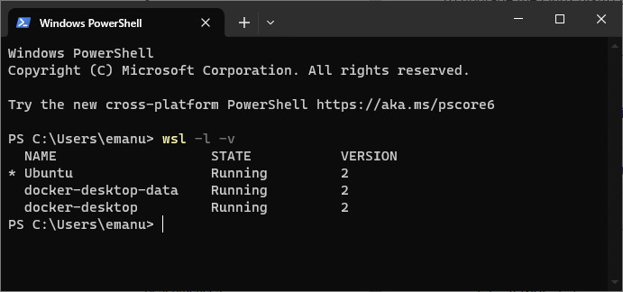
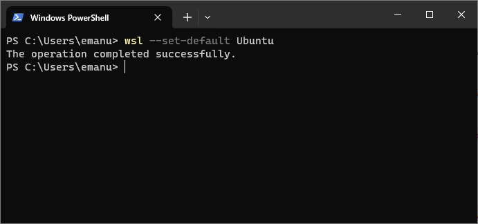
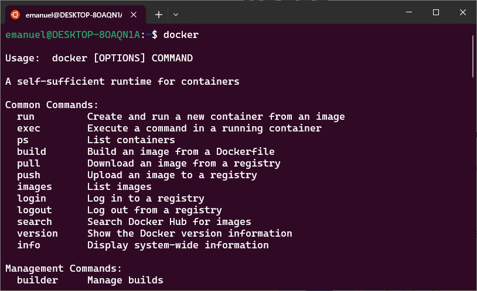

# NeatStore Magento Backend

## Getting started :rocket:

### 1. Install WSL and enable Docker.

To install WSL run: 

```shell
wsl --install
```

To install Docker follow [official documentation](https://docs.docker.com/desktop/install/windows-install/).

### 2. Enable Docker suport in WSL 2 distros

Check official documentation [here](https://docs.docker.com/desktop/wsl/#enabling-docker-support-in-wsl-2-distros).

To check the WSL mode, run:

```shell
wsl.exe -l -v
```



To set the default distro (default is Ubuntu):

```shell
wsl --set-default <distro name>
```



Now check if you can access docker in your distribution terminal:



### 3. Follow installation steps from [docker-magento](https://github.com/markshust/docker-magento) repository

Create a directory for Magento site by running:

```shell
mkdir -p ~/Sites/magento
```

Change working directory to the newly created dir:

```shell
cd $_
```

Install Magento:

```shell
curl -s https://raw.githubusercontent.com/markshust/docker-magento/master/lib/onelinesetup | bash -s -- magento.test 2.4.6-p2 community
```

### 4. Install sample data (optional)

```shell
bin/magento sampledata:deploy
bin/magento setup:upgrade
```


### Install fails because project directory is not empty

Follow the steps from here: https://github.com/markshust/docker-magento#install-fails-because-project-directory-is-not-empty