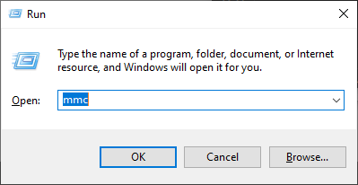
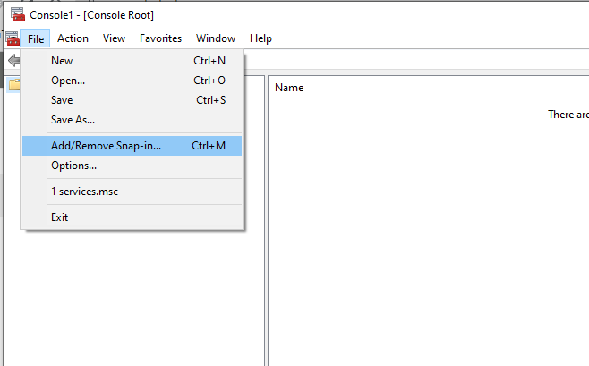
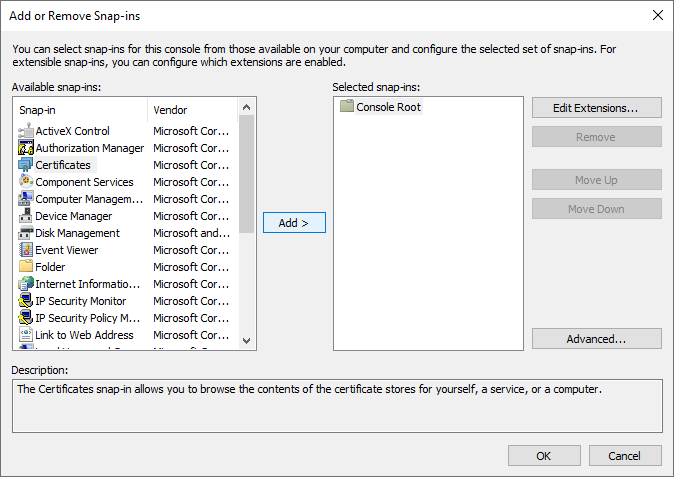
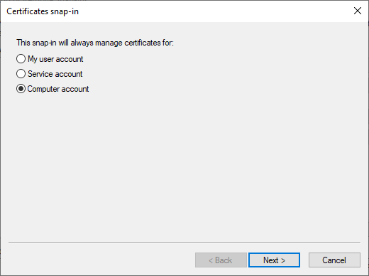
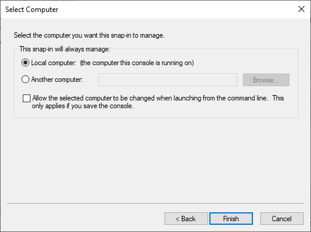
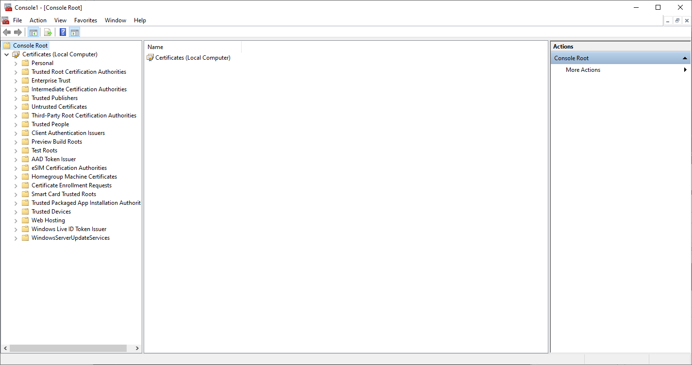
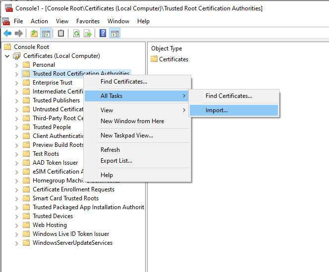

# Install .pem certificate in Windows machine

To install the certificate, first copy it from `~/workspace/magento/rootCA.pem` to your desktop.

1. Run `mmc` to open Microsoft Management Console.

2. Add certificates snap-in.

Select `Computer account` scope:

3. Import `rootCA.pem` certificate.

Follow the default settings.

Restart browser and check if `magento.test` has the secured connection badge.